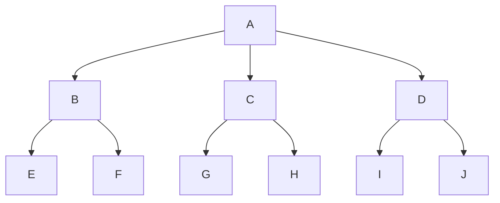
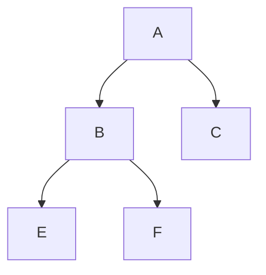
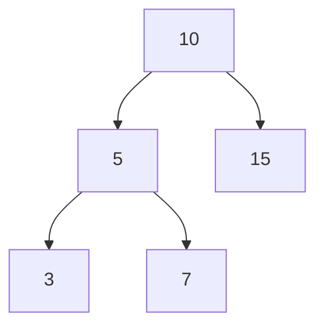

# Data Structures and Algorithms with JavaScript

# Table of Contents

- ## [Big-O Notation](#big-o-notation)
  - [Big-O for Object](#big-o-for-object)
  - [Big-O for Array](#big-o-for-array)
- ## [Algorithms](#algorithms)
  - ### [Math Algorithms](#math-algorithms)
    - [Calculate **_a specific length of fibonacci sequence_**](#calculate-a-specific-length-of-fibonacci-sequence)
    - [Find the **_nth fibonacci sequence_**](#find-the-nth-fibonacci-sequence)
    - [Calculate **_factorial_** of a number](#calculate-factorial-of-a-number)
    - [Check **_if a number is prime or not_**](#check-if-a-number-is-prime-or-not)
    - [Check **_if a number is power of two_**](#check-if-a-number-is-power-of-two)
  - ### [Search Algorithms](#search-algorithms)
    - [Linear Search](#linear-search)
    - [Binary Search](#binary-search)
  - ### [Sorting Algorithms](#sorting-algorithms)
    - [Bubble Sort](#bubble-sort)
    - [Insertion Sort](#insertion-sort)
    - [Quick Sort](#quick-sort)
    - [Merge Sort](#merge-sort)
  - ### [Miscellaneous Algorithms](#miscellaneous-algorithms)
    - [Cartesian Product](#cartesian-product)
    - [Climbing Staircase](#climbing-staircase)
    - [Tower Of Hanoi](#tower-of-hanoi)
- ## [Data Structures](#data-structures)
  - ### [Built In Data Structures](#built-in-data-structures)
    - [Array](#array)
    - [Object](#object)
    - [Set](#set---refer-to-this-doc-to-learn-more-about-set)
    - [Map](#map---refer-to-this-doc-to-learn-more-about-map)
  - ### [Custom Data Structures](#custom-data-structures)
    - [Stack](#stack)
    - [Queue](#queue)
    - [Queue (with array)](#implementationwith-array)
    - [Queue (with object) - optimized](#implementationwith-object---optimized)
    - [Circular Queue](#circular-queue)
    - [Linked List](#linked-list)
      - [Linked List Implementation](#implementation-without-tail-pointer)
      - [Linked List Optimized Implementation](#implementation-with-tail-pointer---more-optimized)
    - [Linked List Stack](#linked-list-stack)
    - [Linked List Queue](#linked-in-queue)
    - [Doubly Linked List](#doubly-linked-list)
    - [Hash Table / Hash Map](#hash-table--hash-map)
    - [Tree](#tree)
      - [Binary Search Tree](#binary-search-tree-bst)

## Big O Notation


Source: [Big O Cheat Sheet](https://www.bigocheatsheet.com/)

To get a good grasp on Big O notation checkout this
[Web Dev Simplified video on Big O notation](https://youtu.be/itn09C2ZB9Y?si=KtfxAVqNPNTPutWw)

### Big O for Object

```js
const person = {
  firstName: "Mehedi",
  age: 24,
};

// If we insert, remove or access a property the time complexity is constant O(1)

// example
person.lastName = "Hasan"; // Insert - constant O(1)
delete person.age; // Remove - constant O(1)
console.log(person.firstName); // Access - constant O(1)

// And object methods like keys, values, entries are linear O(n)
Object.keys(person); // linear O(n)
Object.values(person); // linear O(n)
Object.entries(person); // linear O(n)

// Search - linear O(n)
```

### Big O for Array

```js
const odd = [1, 3, 5, 7];

// Insert / remove at end - constant O(1)
odd.push(9); // Insert at end - constant O(1)
odd.pop(); // Remove at end - constant O(1)

// Insert / remove at beginning - linear O(n)
shift / unshift / concat / slice / splice; // linear O(n)

console.log(odd[0]); // Access - constant O(1)

// Search - linear O(n)

forEach / map / filter / reduce; // linear O(n);
```

# Algorithms

## Math Algorithms

### Calculate **_a specific length of fibonacci sequence_**

```js
function fibonacci(n) {
  const fib = [0, 1];
  for (let i = 2; i < n; i++) {
    // sum previous two item and insert it to the next
    fib[i] = fib[i - 1] + fib[i - 2];
  }

  return fib;
}

console.log(fibonacci(7)); // [0, 1, 1, 2, 3, 5, 8]
```

---

### Find the **_nth fibonacci sequence_**

```js
// Iterative solution - Big O(n)
function fibonacci(n) {
  if (n === 0) return 0;
  if (n === 1) return 1;
  const fib = [0, 1];
  for (let i = 2; i < n; i++) {
    fib[i] = fib[i - 1] + fib[i - 2];
  }
  return fib[fib.length - 1] + fib[fib.length - 2];
}

console.log(fib(2)); // 1
console.log(fib(3)); // 2
console.log(fib(4)); // 3

// ------------------------------

// Recursive solution - Big O(2^n)
function recursiveFibonacci(n) {
  if (n < 2) return n;

  return recursiveFibonacci(n - 1) + recursiveFibonacci(n - 2);
}

console.log(recursiveFibonacci(2)); // 1
console.log(recursiveFibonacci(3)); // 2
console.log(recursiveFibonacci(4)); // 3
```

### Calculate **_factorial_** of a number

```js
// With Recursion
function factorial(n) {
  if (n === 0) return 1;

  return n * factorial(n - 1);
}

console.log(factorial(0)); // 1
console.log(factorial(1)); // 1
console.log(factorial(4)); // 24
console.log(factorial(5)); // 120

// ------------------------------

// With Loop
function factorial(n) {
  let fac = 1;

  for (let i = 2; i <= n; i++) {
    fac = fac * i;
  }

  return fac;
}

console.log(factorial(0)); // 1
console.log(factorial(1)); // 1
console.log(factorial(4)); // 24
console.log(factorial(5)); // 120
```

### Check **_if a number is prime or not_**

```js
// With Loop - Big-O - linear O(n)
function isPrime(n) {
  if (n < 2) return false;

  for (let i = 2; i < n; i++) {
    if (n % i === 0) return false;
  }

  return true;
}

console.log(isPrime(0)); // false
console.log(isPrime(4)); // false
console.log(isPrime(5)); // true

// -------------------------------------

// More Optimized - Big-O - O(sqrt(n))
function isPrime(n) {
  if (n < 2) return false;

  for (let i = 2; i <= Math.sqrt(n); i++) {
    if (n % i === 0) return false;
  }

  return true;
}

console.log(isPrime(0)); // false
console.log(isPrime(4)); // false
console.log(isPrime(5)); // true
```

### Check **_if a number is power of two_**

```js
function isPowerOfTwo(n) {
  if (n < 1) return false;

  while (n > 1) {
    if (n % 2 !== 0) return false;

    n = n / 2;
  }

  return true;
}

console.log(isPowerOfTwo(0)); // false
console.log(isPowerOfTwo(1)); // true as 2^0 = 1
console.log(isPowerOfTwo(2)); // true as 2^1 = 2
console.log(isPowerOfTwo(5)); // false

// ---------------------------------------------

// With bitwise
function isPowerOfTwoBitWise(n) {
  if (n < 1) return false;

  return (n & (n - 1)) === 0;
}

console.log(isPowerOfTwoBitWise(0)); // false
console.log(isPowerOfTwoBitWise(1)); // true
console.log(isPowerOfTwoBitWise(2)); // true
console.log(isPowerOfTwoBitWise(5)); // false
```

## Search Algorithms

### Linear Search

```js
function linearSea(arr, target) {
  for (let i = 0; i < arr.length; i++) {
    if (arr[i] === target) {
      return i;
    }
  }
  return -1;
}
const arr = [1, 3, 5, 7, 9];
const target = 5;
console.log(linearSea(arr, 5)); // Output: 2
console.log(linearSea(arr, 2)); // Output: -1
```

### Binary Search

> In terms of binary search the input array should be sorted if it is not then sort the array first or you can opt for linear search

```js
// binary search - logarithmic Big-O(logn)
function binarySearch(arr, target) {
  let leftIndex = 0;
  let rightIndex = arr.length - 1;

  while (leftIndex <= rightIndex) {
    const middleIndex = Math.floor((leftIndex + rightIndex) / 2);
    if (target === arr[middleIndex]) return middleIndex;
    if (target < arr[middleIndex]) {
      rightIndex = middleIndex - 1;
    } else {
      leftIndex = middleIndex + 1;
    }
  }

  return -1;
}

console.log(binarySearch([-5, 2, 4, 6, 10], 10)); // 4
console.log(binarySearch([-5, 2, 4, 6, 10], 6)); // 3
console.log(binarySearch([-5, 2, 4, 6, 10], 20)); // -1

// -----------------------------------------------------

// Recursive solution - logarithmic Big-O(logn)
function recursiveBinarySearch(arr, target) {
  return search(arr, target, 0, arr.length - 1);
}

function search(arr, target, leftIndex, rightIndex) {
  if (leftIndex > rightIndex) {
    return -1;
  }

  let middleIndex = Math.floor((leftIndex + rightIndex) / 2);
  if (target === arr[middleIndex]) {
    return middleIndex;
  }

  if (target < arr[middleIndex]) {
    return search(arr, target, leftIndex, middleIndex - 1);
  } else {
    return search(arr, target, middleIndex + 1, rightIndex);
  }
}

console.log(recursiveBinarySearch([-5, 2, 4, 6, 10], 10)); // 4
console.log(recursiveBinarySearch([-5, 2, 4, 6, 10], 6)); // 3
console.log(recursiveBinarySearch([-5, 2, 4, 6, 10], 20)); // -1
```

## Sorting Algorithms

### Bubble Sort

<details>
<summary>Bubble Sort Idea</summary>
- Compare adjacent elements in the array and swap the positions if they are not in the intended order.
<br>
- Repeat the instructions as you step through each element in the array.
<br>
- Once you step through the whole array with no swaps, the array is sorted.
</details>
<br>

```js
// Bubble Sort - Big-O - Quadratic O(n^2)
function bubbleSort(arr) {
  let isSwapped;

  do {
    isSwapped = false;
    for (let i = 0; i < arr.length; i++) {
      if (arr[i] > arr[i + 1]) {
        const temp = arr[i];
        arr[i] = arr[i + 1];
        arr[i + 1] = temp;
        isSwapped = true;
      }
    }
  } while (isSwapped);
}

const arr = [2, -5, 6, -1];
bubbleSort(arr);
console.log(arr);
```

### Insertion Sort

<details>
<summary>Insertion Sort Idea</summary>
- Virtually split the array into a sorted and an unsorted part.
<br>
- Assume that the first element is already sorted and the remaining elements are unsorted.
<br>
- Select and unsorted element and compare it with all elements in the unsorted part.
<br>
- If the elements in the sorted part is smaller than the selected element then proceed to the next element in the unsorted part. Else, shift the larger element towards right in the sorted part.
<br>
- Insert the selected element at the right index.
<br>
- Repeat till all the unsorted elements are placed in the right order
</details>
<br>

```js
// Insertion Sort Big-O - Quadratic O(n^2)
function insertionSort(arr) {
  for (let i = 1; i < arr.length; i++) {
    const numberToInsert = arr[i];
    let j = i - 1;
    while (j >= 0 && arr[j] > numberToInsert) {
      arr[j + 1] = arr[j];

      j = j - 1;
    }

    arr[j + 1] = numberToInsert;
  }
}

const arr = [8, 20, -2, 4, -6];
insertionSort(arr);
console.log(arr); // [-6, -2, 4, 8, 20]
```

### Quick Sort

<details>
<summary>Quick Sort Idea</summary>
<br>
- Identify the pivot element in the array
<br>
-- Pick first element as pivot
<br>
-- Pick last element as pivot
<br>
-- Pick random element as pivot
<br>
-- Pick median as pivot
<br>
<br>
- Put everything that's smaller than the pivot into left array and everything that's greater than the pivot into right array
<br>
- Repeat the process for the individual `left` and `right` array till you have a array of length 1 which is sorted by definition
<br>
- Repeatedly concatenate the left array, pivot and right array till one sorted array remains
</details>
<br>

```js
// Quick Sort without constraints / in place
// Worst case - O(n^2) // happens when the arr is already sorted or you try to sort an already sorted arr
// Avg case - O(nlogn)
function quickSort(arr) {
  if (arr.length < 2) {
    return arr;
  }

  const pivot = arr.length - 1;
  const left = [];
  const right = [];

  for (let i = 0; i < arr.length - 1; i++) {
    if (arr[i] < pivot) {
      left.push(arr[i]);
    } else {
      right.push(arr[i]);
    }
  }

  return [...quickSort(left), pivot, ...quickSort(right)];
}

console.log(quickSort([4, -2, 1, -5])); // [ -5, -2, 1, 4 ]

// ---------------------------------------------
// ---------------------------------------------

// Quick Sort with constraints / in place
// Worst case - O(n^2) // happens when the arr is already sorted or you try to sort an already sorted arr
// Avg case - O(nlogn)
function quickSort(arr, left = 0, right = arr.length - 1) {
  if (left < right) {
    const pivot = partition(arr, left, right);
    quickSort(arr, left, pivot - 1);
    quickSort(arr, pivot + 1, right);
  }
  return arr;
}

function partition(arr, left, right) {
  const pivot = arr[right];
  let i = left;
  for (let j = left; j < right; j++) {
    if (arr[j] < pivot) {
      swap(arr, i, j);
      i++;
    }
  }
  swap(arr, i, right);
  return i;
}

function swap(arr, i, j) {
  const temp = arr[i];
  arr[i] = arr[j];
  arr[j] = temp;
}

const arr = [8, 20, -2, 4, -6];
quickSort(arr);
console.log(arr); // [-6, -2, 4, 8, 20]

const arr2 = [8, 20, -2, 4, -6];
quickSort(arr2, 2, 4); // start and end constraint
console.log(arr2); // [ 8, 20, -6, -2, 4 ]
```

### Merge Sort

<details>
<summary>Merge Sort Idea</summary>
- Divide the array into sub arrays, each containing only one element (An array with one element is considered sorted)
<br>
- Repeatedly merge the sub arrays to produce new sorted sub arrays until there is only one sub array remaining. That will be the sorted array.
</details>
<br>

```js
// Big-O - O(nlogn)
function mergesort(arr) {
  if (arr.length < 2) {
    return arr;
  }
  const mid = Math.floor(arr.length / 2);
  const leftArr = arr.slice(0, mid);
  const rightArr = arr.slice(mid);
  return merge(mergesort(leftArr), mergesort(rightArr));
}

function merge(leftArr, rightArr) {
  const sortedArr = [];
  while (leftArr.length && rightArr.length) {
    if (leftArr[0] <= rightArr[0]) {
      sortedArr.push(leftArr.shift());
    } else {
      sortedArr.push(rightArr.shift());
    }
  }
  const resultArr = [...sortedArr, ...leftArr, ...rightArr];
  return resultArr;
}

const arr = [8, 20, -2, 4, -6];
console.log(mergesort(arr)); // [-6, -2, 4, 8, 20]
```

## Miscellaneous Algorithms

### Cartesian Product

```js
// Big-O - O(mn) // depends on length. As both array input
// lengths could be different hence Big-O is O(mn) instead O(n^2)
function cartesianProduct(arr1, arr2) {
  const result = [];

  for (let i = 0; i < arr1.length; i++) {
    for (let j = 0; j < arr2.length; j++) {
      result.push([arr1[i], arr2[j]]);
    }
  }

  return result;
}

const arr1 = [1, 3];
const arr2 = [2, 4, 5];
console.log(cartesianProduct(arr1, arr2)); // [ [ 1, 2 ], [ 1, 4 ], [ 1, 5 ], [ 3, 2 ], [ 3, 4 ], [ 3, 5 ] ]
```

### Climbing Staircase

**_Problem -_** Given a staircase of \`n\` steps, count the number of distinct ways to climb to the top.
<br>
You can either climb 1 step or 2 step at a time.

```js
// Big-O - linear O(n)
function climbingStairCase(n) {
  const numOfWays = [1, 2];
  for (let i = 2; i <= n; i++) {
    numOfWays[i] = numOfWays[i - 1] + numOfWays[i - 2];
  }

  return numOfWays[n - 1];
}

console.log(climbingStairCase(1)); // 1
console.log(climbingStairCase(2)); // 2
console.log(climbingStairCase(3)); // 3
console.log(climbingStairCase(4)); // 5
console.log(climbingStairCase(5)); // 8
```

### Tower Of Hanoi


<br>
Source: [Enjoy Mathematics](https://www.enjoymathematics.com/blog/tower-of-hanoi-puzzle)

<details>
<summary>What is Tower Of Hanoi</summary>
- Tower of hanoi is a mathematical puzzle where we have three rods and a number of disks of various diameters.
<br>
- The objective of the puzzle is to move the entire stack to the last rod obeying following the rules:
<br>
-- Only on disk may be moved at a time.
<br>
-- Each move consists of taking the upper disk from one of the stacks and placing it on top of another stack or on an empty rod. And lastly
<br>
-- No disk may be placed on top of a disk that is smaller
</details>
<br>

```js
// Steps to solve the problem:-
// Steps-1:- Shift `n-1` disks from `A` to `B`, using `C`(when required)
// Steps-2:- Shift last disk from `A` to `C`
// Steps-3:- Shift `n-1` disks from `B` to `C`, using `A`(when required)

// Big-O - O(2^n)
function towerOfHanoi(n, fromRod, toRod, usingRod) {
  if (n === 1) {
    console.log(`Move disk 1 from ${fromRod} to ${toRod}`);
    return;
  }
  towerOfHanoi(n - 1, fromRod, usingRod, toRod);
  console.log(`Move disk ${n} from ${fromRod} to ${toRod}`);
  towerOfHanoi(n - 1, usingRod, toRod, fromRod);
}

towerOfHanoi(3, "A", "C", "B");
// Move disk 1 from A to C
// Move disk 2 from A to B
// Move disk 1 from C to B
// Move disk 3 from A to C
// Move disk 1 from B to A
// Move disk 2 from B to C
// Move disk 1 from A to C
```

<!-------------
Data Structures
--------------->

<br>

# Data Structures

## Built In Data Structures

### Array

### Object

### Set - [refer to this doc to learn more about Set](https://javascript.info/map-set#set)

### Map - [refer to this doc to learn more about Map](https://javascript.info/map-set#map)

### WeakSet and WeakMap - [refer to this doc to learn more about WeakSet and WeakMap](https://javascript.info/weakmap-weakset)

## Custom Data Structures

### Stack

In JavaScript, a stack is a data structure that follows the Last In, First Out (LIFO) principle. This means that the last element added to the stack is the first one to be removed. You can implement a stack using an array in JavaScript.

<details>
<summary>Stack Data Structure Usage</summary>

**_Function Call Management:_**
The call stack is used to manage function calls in programming languages. When a function is called, its information is pushed onto the stack, and when the function completes execution, it is popped off the stack.

**_Expression Evaluation:_**
Stacks are often used to evaluate expressions, especially in languages that use postfix (or Reverse Polish Notation) or infix notation. They help in converting expressions from infix to postfix and then evaluating the postfix expression.

**_Undo Mechanisms in Applications:_**
Undo functionality in applications is often implemented using a stack. Each action that can be undone is pushed onto the stack, and when the user requests an undo, the last action is popped and reversed.

**_Browser History:_**
Web browsers use a stack to keep track of the pages visited. Each new page visited is pushed onto the stack, and navigating back corresponds to popping the stack.

**_Parsing in Compilers:_**
Stacks are used in compiler design for parsing expressions and syntax analysis. They help in managing the order of operations and tracking nested structures.

**_Memory Management:_**
The call stack in a computer's memory is used to manage local variables and function calls. Each function call allocates space on the stack for local variables and parameters.

**_Backtracking Algorithms:_**
Stack-based backtracking is common in algorithms like depth-first search (DFS). The stack keeps track of the path taken, allowing the algorithm to backtrack when needed.

**_Expression Matching:_**
Stacks can be used to match parentheses and brackets in expressions, ensuring that they are balanced and properly nested.

**_Task Management in Operating Systems:_**
The operating system's task or process stack is used to manage the execution of processes and keep track of the function calls within each process.

**_Symbol Balancing in Editors:_**
Text editors and Integrated Development Environments (IDEs) use stacks to check for balanced symbols such as parentheses, braces, and brackets in the code.

</details>
<br>

**_Implementation:_**

```js
class Stack {
  constructor() {
    this.items = [];
  }

  // Add element to the stack
  push(element) {
    this.items.push(element);
  }

  // Remove and return the last element added to the stack
  pop() {
    if (this.items.length === 0) {
      return "Underflow";
    }
    return this.items.pop();
  }

  // Return the last element without removing it
  peek() {
    return this.items[this.items.length - 1];
  }

  // Check if the stack is empty
  isEmpty() {
    return this.items.length === 0;
  }

  // Return the size of the stack
  size() {
    return this.items.length;
  }

  // Clear the stack
  clear() {
    this.items = [];
  }

  // Print the items
  print() {
    console.log(this.items.toString());
  }
}

// Example usage:
const stack = new Stack();

stack.push(1);
stack.push(2);
stack.push(3);

console.log(stack.peek()); // Output: 3

console.log(stack.pop()); // Output: 3
console.log(stack.pop()); // Output: 2

console.log(stack.isEmpty()); // Output: false

console.log(stack.size()); // Output: 1

stack.clear();
console.log(stack.isEmpty()); // Output: true
```

[🔼 Back to top](#data-structures)

### Queue

In JavaScript, a queue is a data structure that follows the First In, First Out (FIFO) principle. This means that the first element added to the queue is the first one to be removed. You can implement a queue using an array in JavaScript.

<details>
<summary>Queue Usage</summary>

**_Task Scheduling:_**
Operating systems often use queues to schedule processes or tasks. The first task to arrive is the first to be executed.

**_Print Queue:_**
In a print spooler, documents sent to the printer are placed in a queue. The printer processes them in the order they are received.

**_Breadth-First Search (BFS) in Graphs:_**
BFS traversal in graphs uses a queue to explore nodes level by level. Nodes are enqueued as they are discovered and dequeued for further exploration.

**_Job Queue in Systems:_**
Systems that handle multiple tasks or jobs often use a job queue to manage and process tasks in the order they are received.

**_Order Processing in E-commerce:_**
When orders are placed in an online store, they are often processed in the order they are received, resembling a queue.

**_Buffer in Networking:_**
In networking, queues are used in routers and switches to manage incoming data packets. Packets wait in a queue until they can be transmitted.

**_Browsing History:_**
Similar to stacks, queues can be used to manage browsing history in web browsers. The first page visited is the first one to be removed when the history limit is reached.

**_Message Queues in Inter-process Communication:_**
Queues are used for communication between different processes. Messages are sent to a queue and retrieved by the receiving process in a first-come, first-served manner.

**_Print Spooling:_**
Print jobs sent to a printer are often stored in a print spooler queue. The printer processes them one by one.

**_Task Management in Asynchronous Programming:_**
In asynchronous programming, a queue is often used to manage the execution of tasks or callbacks. Tasks are queued up and executed in the order they are received.

**_Request Handling in Web Servers:_**
Web servers often use queues to manage incoming requests. Requests are processed in the order they are received.

**_Waiting Lines in Simulations:_**
Queues are commonly used in simulations to model waiting lines, such as customers waiting in line at a bank or in a supermarket.

</details>
<br>

#### **_Implementation(with array)_**

```js
class Queue {
  constructor() {
    this.items = [];
  }

  // Add element to the end of the queue
  enqueue(element) {
    this.items.push(element);
  }

  // Remove and return the front element from the queue
  dequeue() {
    if (this.items.length === 0) {
      return "Underflow";
    }
    return this.items.shift();
  }

  // Return the front element without removing it
  /*front or*/ peek() {
    if (this.items.length === 0) {
      return "Queue is empty";
    }
    return this.items[0];
  }

  // Check if the queue is empty
  isEmpty() {
    return this.items.length === 0;
  }

  // Return the size of the queue
  size() {
    return this.items.length;
  }

  // Clear the queue
  clear() {
    this.items = [];
  }

  // Print the items
  print() {
    console.log(this.items.toString());
  }
}

// Example usage:
const queue = new Queue();

queue.enqueue(1);
queue.enqueue(2);
queue.enqueue(3);

console.log(queue.front()); // Output: 1

console.log(queue.dequeue()); // Output: 1
console.log(queue.dequeue()); // Output: 2

console.log(queue.isEmpty()); // Output: false

console.log(queue.size()); // Output: 1

queue.clear();
console.log(queue.isEmpty()); // Output: true
```

[🔼 Back to top](#data-structures)

#### **_Implementation(with object) - optimized_**

> Previous queue DS implementation was with array which is not performant when the size of the array grows. For instance, we were dequeueing with the array method shift which is linear time complexity. In this optimized queue DS implementation we used object instead of array cause operating in object is more performant than operating in array.

```js
class Queue {
  constructor() {
    this.items = {};
    this.front = 0;
    this.rear = 0;
  }

  // Add element to the end of the queue
  enqueue(element) {
    this.items[this.rear] = element;
    this.rear++;
  }

  // Remove and return the front element from the queue
  dequeue() {
    if (this.front === this.rear) {
      return "Underflow";
    }
    const element = this.items[this.front];
    delete this.items[this.front];
    this.front++;
    return element;
  }

  // Check if the queue is empty
  isEmpty() {
    return this.front === this.rear;
  }

  // Return the front element without removing it
  peek() {
    if (this.isEmpty()) {
      return "Queue is empty";
    }
    return this.items[this.front];
  }

  // Return the size of the queue
  size() {
    return this.rear - this.front;
  }

  // Clear the queue
  clear() {
    this.items = {};
    this.front = 0;
    this.rear = 0;
  }

  print() {
    console.log(this.items);
  }
}

// Example usage:
const queue = new Queue();

queue.enqueue(1);
queue.enqueue(2);
queue.enqueue(3);
queue.print(); // { '0': 1, '1': 2, '2': 3 }
console.log(queue.peek()); // Output: 1

console.log(queue.dequeue()); // Output: 1
console.log(queue.dequeue()); // Output: 2

console.log(queue.isEmpty()); // Output: false

console.log(queue.size()); // Output: 1
queue.print(); // { '2': 3 }

queue.clear();
console.log(queue.isEmpty()); // Output: true
queue.print(); // {}
```

[🔼 Back to top](#data-structures)

### _Circular Queue_

The size of the Circular Queue is fixed and a single block of memory is used as if the first element is connected to the last element.
<br>
Also referred to as circular buffer or ring buffer and follows the FIFO principle.
<br>
A circular queue will reuse the empty block created during the dequeue operation.
<br>
When working with queue of fixed maximum size, a circular queue is a great implementation choice.

<details>
<summary>Circular Queue Usage</summary>

- Clock
- Streaming Data
- Traffic lights
</details>
<br>

**_Implementation:_**

```js
class CircularQueue {
  constructor(capacity) {
    this.items = new Array(capacity);
    this.rear = -1;
    this.front = -1;
    this.currentLength = 0;
    this.capacity = capacity;
  }

  isFull() {
    return this.currentLength === this.capacity;
  }

  isEmpty() {
    return this.currentLength === 0;
  }

  size() {
    return this.currentLength;
  }

  enqueue(item) {
    if (!this.isFull()) {
      this.rear = (this.rear + 1) % this.capacity;
      this.items[this.rear] = item;
      this.currentLength += 1;
      if (this.front === -1) {
        this.front = this.rear;
      }
    }
  }

  dequeue() {
    if (this.isEmpty()) {
      return null;
    }
    const item = this.items[this.front];
    this.items[this.front] = null;
    this.front = (this.front + 1) % this.capacity;
    this.currentLength -= 1;
    if (this.isEmpty()) {
      this.front = -1;
      this.rear = -1;
    }
    return item;
  }

  peek() {
    if (!this.isEmpty()) {
      return this.items[this.front];
    }
    return null;
  }

  print() {
    if (this.isEmpty()) {
      console.log("Queue is empty");
    } else {
      let i;
      let str = "";
      for (i = this.front; i !== this.rear; i = (i + 1) % this.capacity) {
        str += this.items[i] + " ";
      }
      str += this.items[i];
      console.log(str);
    }
  }
}

const queue = new CircularQueue(5);
console.log(queue.isEmpty()); // true
queue.enqueue(10);
queue.enqueue(20);
queue.enqueue(30);
queue.enqueue(40);
queue.enqueue(50);
console.log(queue.size()); // 5
queue.print(); // 10 20 30 40 50
console.log(queue.isFull()); // true
console.log(queue.dequeue()); // 10
console.log(queue.peek()); // 20
queue.print(); // 20 30 40 50
queue.enqueue(60);
queue.print(); // 20 30 40 50 60
```

[🔼 Back to top](#data-structures)

### Linked List

A linked list is a linear data structure in which elements are stored in nodes, and each node points to the next node in the sequence. Unlike arrays, linked lists do not have a fixed size, and their elements can be dynamically allocated. The basic components of a linked list include nodes and pointers.

<details>
<summary>Most common usage of linked list</summary>

**_Dynamic Memory Allocation:_**
Linked lists are useful when the size of the data structure is not known in advance or may change frequently. They allow for dynamic memory allocation, as nodes can be added or removed easily without the need for contiguous memory.

**_Implementation of Data Structures:_**
Linked lists are fundamental in the implementation of various data structures such as stacks, queues, and symbol tables. For example, a stack or a queue can be easily implemented using a linked list by manipulating the pointers to achieve last-in-first-out (LIFO) or first-in-first-out (FIFO) behavior.

**_Memory Management:_**
Linked lists are used in memory management systems, like the free block list in dynamic memory allocation. The free memory blocks are maintained in a linked list, and when memory is requested, the allocator can efficiently find and allocate the appropriate-sized block.

**_Undo Functionality in Software:_**
Linked lists are often used to implement undo functionality in software applications. Each action performed is stored as a node in a linked list, and by traversing the list backward, the application can undo each action in sequence.

**_File Systems:_**
Linked lists are employed in file systems to represent the structure of directories and files. Each directory or file is represented as a node, and the pointers link the nodes together to form the hierarchy. This allows for efficient traversal and manipulation of the file system structure.

</details>
<br>

#### **_Implementation (without tail pointer):_**

```js
class Node {
  constructor(value) {
    this.value = value;
    this.next = null;
  }
}

class LinkedList {
  constructor() {
    this.head = null;
    this.size = 0;
  }

  isEmpty() {
    return this.size === 0;
  }

  getSize() {
    return this.size;
  }

  // Big-O - constant O(1)
  prepend(value) {
    const node = new Node(value);

    if (this.isEmpty()) {
      this.head = node;
    } else {
      node.next = this.head;
      this.head = node;
    }

    this.size++;
  }

  // Big-O - linear O(n)
  append(value) {
    const node = new Node(value);
    if (this.isEmpty()) {
      this.head = node;
    } else {
      let prev = this.head;

      while (prev.next) {
        prev = prev.next;
      }

      prev.next = node;
    }

    this.size++;
  }

  insert(value, index) {
    if (index < 0 || index > this.size) {
      console.log("Invalid index");
      return;
    }

    if (index === 0) {
      this.prepend(value);
    } else {
      const node = new Node(value);
      let prev = this.head;

      for (let i = 0; i < index - 1; i++) {
        prev = prev.next;
      }

      node.next = prev.next;
      prev.next = node;

      this.size++;
    }
  }

  removeFrom(index) {
    if (index < 0 || index >= this.size) {
      console.log("invalid index! index is not in the list");
      return null;
    }

    let removedNode;

    if (index === 0) {
      removedNode = this.head;
      this.head = this.head.next;
    } else {
      let prev = this.head;

      for (let i = 0; i < index - 1; i++) {
        prev = prev.next;
      }

      removedNode = prev.next;
      prev.next = removedNode.next;
    }

    this.size--;
    return removedNode.value;
  }

  removeValue(value) {
    if (this.isEmpty()) {
      console.log("list is empty");
      return null;
    }

    if (this.head.value === value) {
      this.head = this.head.next;
      this.size--;
      console.log("Node has been deleted");
      return value;
    } else {
      let prev = this.head;

      while (prev.next && prev.next.value !== value) {
        prev = prev.next;
      }

      if (prev.next) {
        const removedNode = prev.next;
        prev.next = removedNode.next;
        this.size--;
        console.log("Node has been deleted");
        return value;
      }

      return null;
    }
  }

  search(value) {
    if (this.isEmpty()) {
      return -1;
    }

    let index = 0;
    let curr = this.head;

    while (curr) {
      if (curr.value === value) {
        return index;
      }
      curr = curr.next;
      index++;
    }

    return -1;
  }

  reverse() {
    let prev = null;
    let curr = this.head;

    while (curr) {
      let next = curr.next;
      curr.next = prev;
      prev = curr;
      curr = next;
    }

    this.head = prev;
  }

  print() {
    if (this.isEmpty()) {
      console.log("List is empty");
    } else {
      let curr = this.head;
      let listValues = "";

      while (curr) {
        listValues += `${curr.value} `;
        curr = curr.next;
      }

      console.log(listValues);
    }
  }
}

const linkedList = new LinkedList();

console.log(linkedList.getSize()); // 0
console.log(linkedList.isEmpty()); // true

linkedList.append(20);
linkedList.append(30);
linkedList.append(40);
linkedList.append(50);

console.log(linkedList.getSize()); // 4
console.log(linkedList.isEmpty()); // false
linkedList.print(); // 20 30 40 50

console.log(linkedList.removeFrom(1)); // 30
linkedList.print(); // 20 40 50

linkedList.append(60);
linkedList.print(); // 20 40 50 60

console.log(linkedList.removeValue(50)); // 50
linkedList.print(); // 20 40 60

console.log(linkedList.search(40)); // 1
console.log(linkedList.search(90)); // -1

linkedList.reverse();
linkedList.print(); // 60 40 20

linkedList.insert(70, 2);
linkedList.print(); // 60 40 70 20
```

[🔼 Back to top](#data-structures)

#### **_Implementation (with tail pointer - more optimized):_**

```js
class Node {
  constructor(value) {
    this.value = value;
    this.next = null;
  }
}

class LinkedList {
  constructor() {
    this.head = null;
    this.tail = null;
    this.size = 0;
  }

  isEmpty() {
    return this.size === 0;
  }

  getSize() {
    return this.size;
  }

  // Big-O - constant O(1)
  prepend(value) {
    const node = new Node(value);
    if (this.isEmpty()) {
      this.head = node;
      this.tail = node;
    } else {
      node.next = this.head;
      this.head = node;
    }

    this.size++;
  }

  // Big-O - constant O(1)
  append(value) {
    const node = new Node(value);

    if (this.isEmpty()) {
      this.head = node;
      this.tail = node;
    } else {
      this.tail.next = node;
      this.tail = node;
    }

    this.size++;
  }

  insert(value, index) {
    if (index < 0 || index > this.size) {
      console.log("Invalid index");
      return;
    }

    if (index === 0) {
      this.prepend(value);
    } else {
      const node = new Node(value);
      let prev = this.head;

      for (let i = 0; i < index - 1; i++) {
        prev = prev.next;
      }

      node.next = prev.next;
      prev.next = node;

      this.size++;
    }
  }

  removeFromFront() {
    if (this.isEmpty()) {
      console.log("List is empty");
      return null;
    }

    const value = this.head.value;

    if (this.size === 1) {
      this.head = null;
      this.tail = null;

      this.size--;

      return value;
    }

    // const value = this.head.value;
    this.head = this.head.next;

    this.size--;

    return value;
  }

  removeFrom(index) {
    if (index < 0 || index >= this.size) {
      console.log("invalid index! index is not in the list");
      return null;
    }

    let removedNode;

    if (index === 0) {
      removedNode = this.head;
      this.head = this.head.next;
    } else {
      let prev = this.head;

      for (let i = 0; i < index - 1; i++) {
        prev = prev.next;
      }

      removedNode = prev.next;
      prev.next = removedNode.next;
    }

    this.size--;
    return removedNode.value;
  }

  removeFromEnd() {
    if (this.isEmpty()) {
      return null;
    }

    const value = this.tail.value;

    if (this.size === 1) {
      this.head = null;
      this.tail = null;
    } else {
      let prev = this.head;
      while (prev.next !== this.tail) {
        prev = prev.next;
      }
      prev.next = null;
      this.tail = prev;
    }

    this.size--;
    return value;
  }

  removeValue(value) {
    if (this.isEmpty()) {
      console.log("list is empty");
      return null;
    }

    if (this.head.value === value) {
      this.head = this.head.next;
      this.size--;
      console.log("Node has been deleted");
      return value;
    } else {
      let prev = this.head;

      while (prev.next && prev.next.value !== value) {
        prev = prev.next;
      }

      if (prev.next) {
        const removedNode = prev.next;
        prev.next = removedNode.next;
        this.size--;
        console.log("Node has been deleted");
        return value;
      }

      return null;
    }
  }

  search(value) {
    if (this.isEmpty()) {
      return -1;
    }

    let index = 0;
    let curr = this.head;

    while (curr) {
      if (curr.value === value) {
        return index;
      }
      curr = curr.next;
      index++;
    }

    return -1;
  }

  reverse() {
    let prev = null;
    let curr = this.head;

    while (curr) {
      let next = curr.next;
      curr.next = prev;
      prev = curr;
      curr = next;
    }

    this.head = prev;
  }

  print() {
    if (this.isEmpty()) {
      console.log("List is empty");
    } else {
      let curr = this.head;
      let listValues = "";

      while (curr) {
        listValues += `${curr.value} `;
        curr = curr.next;
      }

      console.log(listValues);
    }
  }
}

const linkedList = new LinkedList();

console.log(linkedList.getSize()); // 0
console.log(linkedList.isEmpty()); // true

linkedList.append(20);
linkedList.append(30);
linkedList.append(40);
linkedList.append(50);

linkedList.print(); // 20 30 40 50

linkedList.removeFromFront();

linkedList.print(); // 30 40 50

console.log(linkedList.getSize()); // 3
console.log(linkedList.isEmpty()); // false
linkedList.print(); // 30 40 50

console.log(linkedList.removeFrom(1)); // 40
linkedList.print(); // 30 50

linkedList.append(60);
linkedList.print(); // 30 50 60

console.log(linkedList.removeValue(50)); // 50
linkedList.print(); // 30 60

console.log(linkedList.search(60)); // 1
console.log(linkedList.search(90)); // -1

linkedList.reverse();
linkedList.print(); // 60 30

linkedList.insert(70, 2);
linkedList.print(); // 60 30 70
```

[🔼 Back to top](#data-structures)

### Linked List Stack

> We can implement stack data structure by reusing the linked list data structure

**_Implementation:_**

```js
class LinkedListStack {
  constructor() {
    // we are reusing the LikedList data structure
    this.list = new LinkedList();
  }

  push(value) {
    this.list.prepend(value);
  }

  pop() {
    return this.list.removeFromFront();
  }

  peek() {
    return this.list.head.value;
  }

  getSize() {
    return this.list.getSize();
  }

  isEmpty() {
    return this.list.isEmpty();
  }

  print() {
    this.list.print();
  }
}

const stack = new LinkedListStack();

console.log(stack.isEmpty()); // true
console.log(stack.getSize()); // 0

stack.push(10);
stack.push(20);
stack.push(30);

console.log(stack.isEmpty()); // false
console.log(stack.getSize()); // 3

console.log(stack.peek()); // 30

stack.print(); // 30 20 10
stack.pop();
stack.print(); // 20 10
```

[🔼 Back to top](#data-structures)

### Linked In Queue

> We can implement queue data structure by reusing the linked list data structure

**_Implementation:_**

```js
class LinkedListQueue {
  constructor() {
    this.list = new LinkedList();
  }

  enqueue(value) {
    this.list.append(value);
  }

  dequeue() {
    return this.list.removeFromFront();
  }

  peek() {
    if (this.list.isEmpty()) {
      return null;
    }
    return this.list.head.value;
  }

  getSize() {
    return this.list.getSize();
  }

  isEmpty() {
    return this.list.isEmpty();
  }

  print() {
    this.list.print();
  }
}

const queue = new LinkedListQueue();

console.log(queue.isEmpty()); // true
console.log(queue.getSize()); // 0

queue.enqueue(10);
queue.enqueue(20);
queue.enqueue(30);

console.log(queue.isEmpty()); // false
console.log(queue.getSize()); // 3

console.log(queue.peek()); // 10

queue.print(); // 10 20 30
console.log(queue.dequeue());
queue.print(); // 20 30
```

[🔼 Back to top](#data-structures)

### Doubly Linked List

A doubly linked list is a data structure in which each node contains a data element and two pointers, one pointing to the next node in the sequence (next pointer) and another pointing to the previous node (previous pointer). This bidirectional linking allows for more versatile traversal in both directions.

**_Implementation:_**

```js
class Node {
  constructor(value) {
    this.value = value;
    this.prev = null;
    this.next = null;
  }
}

class DoublyLinkedList {
  constructor() {
    this.head = null;
    this.tail = null;
    this.size = 0;
  }

  isEmpty() {
    return this.size === 0;
  }

  getSize() {
    return this.size;
  }

  prepend(value) {
    const node = new Node(value);
    if (this.isEmpty()) {
      this.head = node;
      this.tail = node;
    } else {
      node.next = this.head;
      this.head.prev = node;
      this.head = node;
    }
    this.size++;
  }

  append(value) {
    const node = new Node(value);
    if (this.isEmpty()) {
      this.head = node;
      this.tail = node;
    } else {
      this.tail.next = node;
      node.prev = this.tail;
      this.tail = node;
    }
    this.size++;
  }

  removeFromFront() {
    if (this.isEmpty()) {
      return null;
    }
    const value = this.head.value;
    this.head = this.head.next;
    this.size--;
    return value;
  }

  removeFromEnd() {
    if (this.isEmpty()) {
      return null;
    }
    const value = this.tail.value;
    if (this.size === 1) {
      this.head = null;
      this.tail = null;
    } else {
      this.tail = this.tail.prev;
      this.tail.next = null;
    }
    this.size--;
    return value;
  }

  print() {
    if (this.isEmpty()) {
      console.log("List is empty");
    } else {
      let curr = this.head;
      let list = "";
      while (curr) {
        list += `${curr.value}<->`;
        curr = curr.next;
      }
      console.log(list);
    }
  }

  printReverse() {
    if (this.isEmpty()) {
      console.log("List is empty");
    } else {
      let curr = this.tail;
      let list = "";
      while (curr) {
        list += `${curr.value}<->`;
        curr = curr.prev;
      }
      console.log(list);
    }
  }
}

const list = new DoublyLinkedList();
list.append(1);
list.append(2);
list.append(3);
list.prepend(0);
list.print(); // 0<->1<->2<->3<->
list.printReverse(); // 3<->2<->1<->0<->
list.removeFromEnd();
list.print(); // 0<->1<->2<->
list.removeFromFront();
list.print(); // 1<->2<->
```

[🔼 Back to top](#data-structures)

### Hash Table / Hash Map

- Most common usage of Hash Table
  - Database Indexing
  - Caching

**_Implementation:_**

```js
class HashTable {
  constructor(size) {
    this.table = new Array(size);
    this.size = size;
  }

  hash(key) {
    let indexKey = 0;
    for (let i = 0; i < key.length; i++) {
      indexKey += key.charCodeAt(i);
    }

    // the index should be withing the size of the array
    return indexKey % this.size;
  }

  set(key, value) {
    const index = this.hash(key);
    const bucket = this.table[index];

    if (!bucket) {
      this.table[index] = [[key, value]];
    } else {
      const sameKeyItem = bucket.find((item) => item[0] === key);

      if (sameKeyItem) {
        sameKeyItem[1] = value;
      } else {
        bucket.push([key, value]);
      }
    }
  }

  get(key) {
    const index = this.hash(key);
    const bucket = this.table[index];

    if (bucket) {
      const sameKeyItem = bucket.find((item) => item[0] === key);
      if (sameKeyItem) {
        return sameKeyItem[1];
      }
    }

    return undefined;
  }

  remove(key) {
    const index = this.hash(key);
    const bucket = this.table[index];

    if (bucket) {
      const sameKeyItem = bucket.find((item) => item[0] === key);

      if (sameKeyItem) {
        bucket.splice(bucket.indexOf(sameKeyItem), 1);
      }
    }
  }

  display() {
    for (let i = 0; i < this.table.length; i++) {
      if (this.table[i]) {
        console.log(i, this.table[i]);
      }
    }
  }
}

const table = new HashTable(50);

table.set("name", "Bruce");
table.set("age", 24);
table.display();

console.log(table.get("name"));

table.remove("name");

table.display();
```

[🔼 Back to top](#data-structures)

### Tree



<br>

- A tree is a hierarchical data structure that consists of nodes connected by edges

- A tree is a non-linear data structure, compared to arrays, linked lists, stacks and
  queues which are linear data structures.
- In linear data structures, the time required to search is proportional to the size of
  the data set
- Trees however, owing to the nonlinear nature allow quicker and easier access to
  the data
- A tree will not contain any loops or cycles.

<br>

<details>
<summary>Some common types of tree data structure</summary>

**_Binary Tree:_**
A tree in which each node has at most two children, referred to as the left child and the right child.

**_Binary Search Tree (BST):_**
A binary tree with the property that the key in each node is greater than or equal to any key in its left subtree and less than or equal to any key in its right subtree.

**_AVL Tree:_**
A self-balancing binary search tree where the height difference between the left and right subtrees of any node (the balance factor) is at most 1. This ensures logarithmic height and efficient search, insert, and delete operations.

**_Red-Black Tree:_**
Another self-balancing binary search tree with the property that each node has a color (either red or black), and the tree is balanced based on certain rules, ensuring logarithmic height.

</details>

<br>

<details>
<summary>Usage of Tree Data Structure:</summary>

- File systems for directory structure

- A family tree

- An organisation tree
- DOM
- Chat bots
- Abstract syntax trees
  </details>

    <br>

<details>
<summary>Terminology:</summary>

<br>



<br>

**_Node:_**
A fundamental building block of a tree that contains data and may have a reference to one or more child nodes. Here `A, B, C, D, E, F` are individual node.

**_Root:_**
The topmost node in a tree structure. It serves as the starting point for traversing the tree. Here `A` is the root node

**_Parent:_**
A node in a tree that has one or more child nodes. The node directly above another node is considered its parent. Here `A` is the parent of child `B` and `C`

**_Child:_**
A node in a tree that is directly connected to another node (its parent) beneath it. Here `B` and `C` is the child of `A`.

**_Leaf:_**
A node in a tree that has no children, meaning it is a terminal node at the end of a branch. Here `E`, `F` and `C` are the leaf node.

**_Siblings:_**
Nodes that share the same parent are called siblings. They are on the same level of the tree.

**_Ancestor:_**
A node that is on a path from a given node to the root node. All ancestors of a node are higher in the tree. Here `A` is the ancestor of `E`

**_Descendant:_**
A node that is on a path from the root node to a given node. All descendants of a node are below it in the tree.

**_Subtree:_**
A tree formed by a node and its descendants.

**_Level:_**
The level of a node is its distance from the root node. The root is considered to be at level 0, and its children are at level 1, and so on.

**_Height:_**
The height of a tree is the length of the longest path from the root node to a leaf. The height of leaf `E` node is 0 and `A` is 2.

**_Depth:_**
The depth of a node is the number of edges present in path from the root node of a tree to that node. The depth of `E` is 2 and `A` is 0.

**_Binary Tree:_**
A tree in which each node has at most two children, referred to as the left child and the right child.

**_Binary Search Tree (BST):_**
A binary tree in which the left subtree of a node contains only nodes with keys less than the node's key, and the right subtree contains only nodes with keys greater than the node's key.

**_Balanced Tree:_**
A tree in which the height of the left and right subtrees of any node differs by at most one.

**_Traversal:_**
The process of visiting all the nodes of a tree in a specific order. Common traversal methods include in-order, pre-order, and post-order.

**_Node Degree:_**
The degree of a node in a tree is the number of children it has. For example:
A node with no children (a leaf) has a degree of 0.
A node with one child has a degree of 1.
A node with two children (common in binary trees) has a degree of 2.

**_Tree Degree:_**
The degree of a tree is defined as the maximum degree of any node in the tree. In other words, it is the maximum number of children that any node in the tree has.
For example, in a binary tree, the maximum degree is 2 because each node can have at most two children. In a ternary tree, the maximum degree is 3, and so on.

</details>
<br>

### Binary Search Tree (BST)

<br>



<br>

Binary Search Tree is tree data structure where -

- The value of each left node must be smaller than the parent node
- The value of each right node must be greater than the parent node
- Each node has at most two children

<details>
<summary>
Binary Search Tree Usage
</summary>

- Searching
- Sorting
- To implement abstract data types such as lookup tables and priority queues
</details>
<br>

<details>
<summary>
Tree Traversal
</summary>

Tree Traversal means Visiting every node in the tree.
<br>
A hierarchical data structure like a tree can be traversed in different ways.

1.  Depth First Search (DFS)

    - The DFS algorithm starts at the root node and explores as far as possible along
      each branch before backtracking
    - Visit the root node, visit all the nodes in the left subtree and visit all the nodes in
      the right subtree
    - Depending on the order in which we do this, there can be three types of DFS
      traversals

      1. Preorder Traversal
      2. Inorder Traversal
      3. Postorder Traversal

2.  Breadth First Search (BFS)

    - Explore all nodes at the present depth prior to moving on to the nodes at the next depth level
    </details>
    <br>

```js
class Node {
  constructor(value) {
    this.value = value;
    this.left = null;
    this.right = null;
  }
}

class BinarySearchTree {
  constructor() {
    this.root = null;
  }

  isEmpty() {
    return this.root === null;
  }

  insert(value) {
    // If the current root is null, a new node with the value is created and assigned as root node.
    const newNode = new Node(value);
    if (this.isEmpty()) {
      this.root = newNode;
    } else {
      this._insertNode(this.root, newNode);
    }
  }

  _insertNode(root, newNode) {
    // If the value is less than the current root's value, the insertion is done in the left subtree.
    if (newNode.value < root.value) {
      // if left pointer empty point it to the new node
      if (root.left === null) {
        root.left = newNode;

        // else recursively check if there's empty spot below
      } else {
        this._insertNode(root.left, newNode);
      }

      // If the value is greater, the insertion is done in the right subtree.
    } else {
      // if right pointer empty point it to the new node
      if (root.right === null) {
        root.right = newNode;

        // else recursively check if there's empty spot below
      } else {
        this._insertNode(root.right, newNode);
      }
    }
  }

  search(value) {
    return this._searchNode(this.root, value);
  }

  _searchNode(root, value) {
    // If the current node is null, return null.
    if (!root) {
      return null;
    } else {
      // If the current node's value matches the target value, return the current value.
      if (root.value === value) {
        return value;

        // If the target value is less than the current node's value, recurse on the left subtree.
      } else if (value < root.value) {
        return this._searchNode(root.left, value);

        // If the target value is greater, recurse on the right subtree.
      } else {
        return this._searchNode(root.right, value);
      }
    }
  }

  // Depth First Search
  // PreOrder Traversal
  preOrder(callback) {
    this._preOrder(this.root, callback);
  }

  _preOrder(root, callback) {
    if (root) {
      // 1. Read the data of the node
      callback(root.value);

      // 2. Visit the left subtree
      this._preOrder(root.left, callback);

      // 3. Visit the right subtree
      this._preOrder(root.right, callback);
    }
  }

  // Depth First Search
  // InOrder Traversal
  inOrder(callback) {
    this._inOrder(this.root, callback);
  }

  _inOrder(root, callback) {
    if (root) {
      // 1. Visit the left subtree
      this._inOrder(root.left, callback);

      // 2. Read the data of the node
      callback(root.value);

      // 3. Visit the right subtree
      this._inOrder(root.right, callback);
    }
  }

  // Depth First Search
  // PostOrder Traversal
  postOrder(callback) {
    this._postOrder(this.root, callback);
  }

  _postOrder(root, callback) {
    if (root) {
      // 1. Visit the left subtree
      this._postOrder(root.left, callback);

      // 2. Visit the right subtree
      this._postOrder(root.right, callback);

      // 3. Read the data of the node
      callback(root.value);
    }
  }

  // Breadth First Search
  // LevelOrder Traversal
  levelOrder(callback) {
    // 1. Create a queue
    // Check the queue implementation above
    const queue = new Queue();

    // 2. Enqueue the root node
    queue.enqueue(this.root);

    while (queue.size()) {
      // a. Dequeue the node from the front
      let curr = queue.dequeue();

      // b. Read the node's value
      callback(curr.value);

      // C. Enqueue the node's left child if it exists
      if (curr.left) {
        queue.enqueue(curr.left);
      }
      // d. Enqueue the node's right child if it exists
      if (curr.right) {
        queue.enqueue(curr.right);
      }
    }
  }

  min(root = this.root) {
    if (!root.left) {
      return root.value;
    } else {
      return this.min(root.left);
    }
  }

  max(root = this.root) {
    if (!root.right) {
      return root.value;
    } else {
      return this.max(root.right);
    }
  }

  delete(value) {
    this.root = this._deleteNode(this.root, value);
  }

  _deleteNode(root, value) {
    if (root === null) {
      return root;
    }
    // if value is less than root value then traverse the left subtree
    if (value < root.value) {
      root.left = this._deleteNode(root.left, value);

      // if value is greater than root value then traverse the right subtree
    } else if (value > root.value) {
      root.right = this._deleteNode(root.right, value);
    } else {
      // Case 1: Node with No Children (Leaf Node):
      // - Simply remove the node.
      if (!root.left && !root.right) {
        return null;
      }

      // Case 2: Node with One Child:
      // - Remove the node and replace it with its child.
      if (!root.left) {
        return root.right;
      } else if (!root.right) {
        return root.left;
      }

      // Case 3: Node with Two Children:
      // - Find the node's in-order successor (or predecessor), replace the node's value with the successor's value, and then recursively delete the successor.
      root.value = this.min(root.right);
      root.right = this._deleteNode(root.right, root.value);
    }

    return root;
  }
}

const bst = new BinarySearchTree();

console.log(bst.isEmpty()); // true

bst.insert(10);
bst.insert(5);
bst.insert(15);
bst.insert(3);
bst.insert(7);

const preOrderResult = [];
bst.preOrder((value) => preOrderResult.push(value));
console.log(preOrderResult); // [ 10, 5, 3, 7, 15 ]

const inOrderResult = [];
bst.inOrder((value) => inOrderResult.push(value));
console.log(inOrderResult); // [ 3, 5, 7, 10, 15 ]

const postOrderResult = [];
bst.postOrder((value) => postOrderResult.push(value));
console.log(postOrderResult); // [ 3, 7, 5, 15, 10 ]

const levelOrderResult = [];
bst.levelOrder((value) => levelOrderResult.push(value));
console.log(levelOrderResult); // [ 10, 5, 15, 3, 7 ]

bst.delete(10);

const levelOrderResult2 = [];
bst.levelOrder((value) => levelOrderResult2.push(value));
console.log(levelOrderResult2); // [ 15, 5, 3, 7 ]

console.log(bst.min()); // 3
console.log(bst.max()); // 15

console.log(bst.isEmpty()); // false
console.log(bst.search(5)); // 5
console.log(bst.search(2)); // null
```

[🔼 Back to top](#data-structures)
